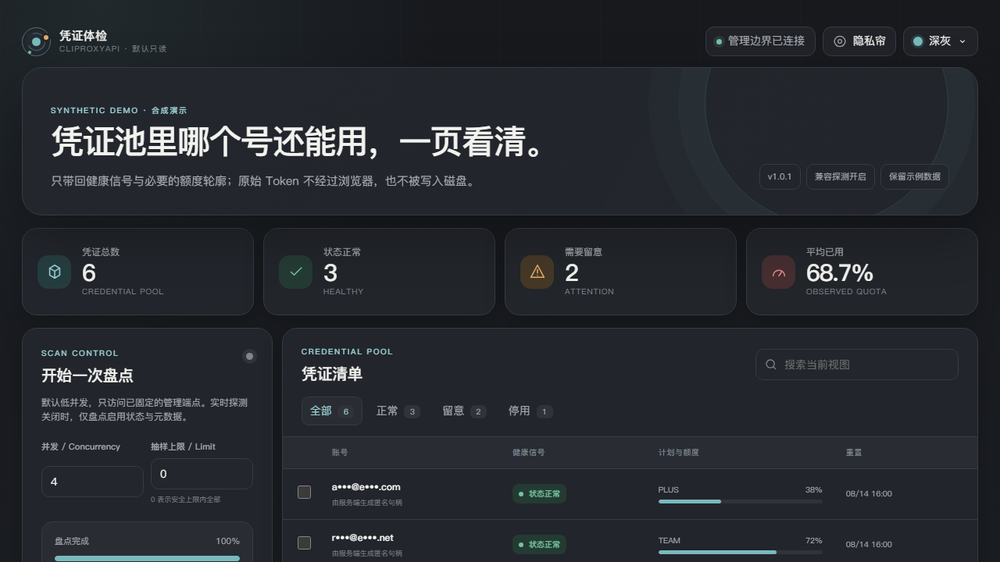

<div align="center">

  

  # CLIProxyAPI credential check

  [中文](README.md) · English

  [](https://github.com/ferretgeek/cliproxyapi-credential-check/actions/workflows/ci.yml)
  [](https://github.com/ferretgeek/cliproxyapi-credential-check/actions/workflows/codeql.yml)
  [](https://www.python.org/)
  [](LICENSE)

  [Deployment](docs/DEPLOYMENT.md) · [Security boundary](docs/SECURITY-BOUNDARY.md) · [Compatibility](docs/COMPATIBILITY.md)

</div>

> Which credentials in your CLIProxyAPI pool still work, and which ones should be replaced?

## Why this exists

Run a [CLIProxyAPI](https://github.com/router-for-me/CLIProxyAPI) credential pool long enough and it turns into a pile of files you're afraid to touch: thirty credentials, a vague memory of which few are good, and no confidence to delete or use the rest.

Working it out means opening config files one by one, reading logs, and firing test requests — every step of which carries risk, whether that's deleting a credential still in use or leaving a token in your shell history.

This dashboard has a deliberately narrow job: **inventory the pool's enablement state and health signals, and present them fully masked.** Disabling and restoring happen here too, but each action requires typing an exact confirmation phrase.

It is **read-only by default.** Disable and restore are capabilities the operator must explicitly enable, not buttons you get for free.

## Interface



## It deliberately does less

What this project *doesn't* do is its most important property, so that comes first:

- **The management key exists only in the server process's memory.** The web UI can neither view nor change the upstream address or key.
- **Accounts are masked by default.** Raw tokens, upstream response bodies, credential files, and real IDs **never reach the browser, logs, or disk.**
- **Read-only by default.** Disable and restore require the operator to set `COMPASS_ALLOW_STATUS_CHANGES`, and each action requires an exact typed confirmation phrase.
- **No delete.** No credential ZIP download, no arbitrary request proxying, no third-party frontend assets.
- Four global themes — Azure, Jade, Sunset, and deep gray with a `#17191d` background.

## See it in three minutes

```powershell
py -3.10 -m venv .venv
.\.venv\Scripts\python -m pip install -e .
.\.venv\Scripts\python -m credential_compass --demo
```

Open the local address printed in the terminal and enter the one-time access token.

Demo mode uses only the reserved domains `example.com`, `example.net`, and `example.org` and **connects to no real account** — so you can evaluate the interface before pointing it at anything live.

Real mode, Docker, reverse proxy, and systemd examples are covered in [deployment](docs/DEPLOYMENT.md).

## Two layers, and the second is off by default

This deserves its own section:

**Inventory layer (enabled by default)** — reads CLIProxyAPI's credential inventory and enablement state, producing masked accounts and anonymous handles. This layer uses stable interfaces.

**Probe layer (disabled by default)** — uses the CLIProxyAPI management `api-call` capability to request one fixed ChatGPT usage endpoint, then reduces the response to a health and quota outline.

The probe layer relies on a **compatibility path that was never promised as a stable public API** and can break whenever upstream changes. That's why `COMPASS_ENABLE_LIVE_PROBE=false` is the default — rather than on by default and broken later. With probing off, inventory reporting is still fully usable.

For the same reason, status changes also depend on the management API and are gated behind `COMPASS_ALLOW_STATUS_CHANGES=false`.

> **After upgrading CLIProxyAPI**, verify inventory, probing, and status changes against isolated synthetic or low-risk accounts before relying on them.

See [compatibility](docs/COMPATIBILITY.md) for details.

## What it doesn't do

- **It doesn't sign in to Codex.** It accepts no OpenAI API key, ChatGPT cookie, or login token.
- It connects only to the CLIProxyAPI management endpoint the operator configured, and proxies no arbitrary requests.
- It cannot delete credentials and offers no credential file download.
- It doesn't bypass or relax any usage limit.

Codex itself supports both ChatGPT sign-in and API keys — follow [OpenAI's Codex authentication documentation](https://learn.chatgpt.com/docs/auth).

## Development checks

```powershell
$env:PYTHONPATH = "src"
python -m unittest discover -s tests -v
ruff check .
ruff format --check .
```

## More documentation

[Deployment](docs/DEPLOYMENT.md) · [Security boundary](docs/SECURITY-BOUNDARY.md) · [Compatibility](docs/COMPATIBILITY.md) · [Release audit](docs/发布审计.md) · [Changelog](CHANGELOG.md) · [Contributing](CONTRIBUTING.md) · [Security policy](SECURITY.md)

Report security issues via GitHub Private vulnerability reporting. **Never post real accounts, tokens, management addresses, logs, or screenshots in a public issue.**

## License and disclaimer

MIT License — see [LICENSE](LICENSE).

Independent community project with no affiliation with, authorization from, or endorsement by OpenAI or the upstream CLIProxyAPI project, and it does not bypass any usage limit.
